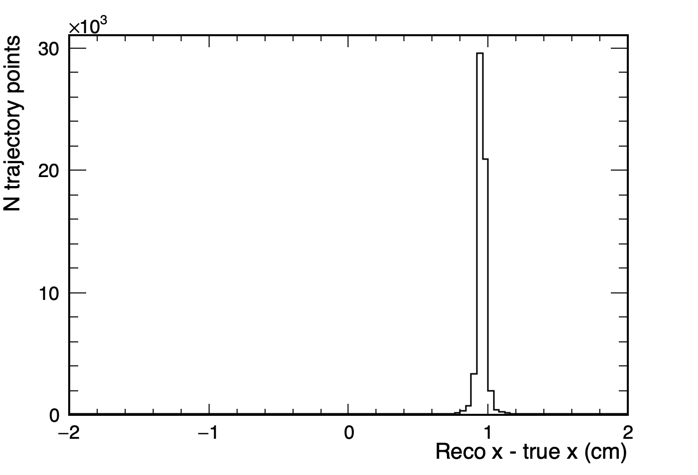
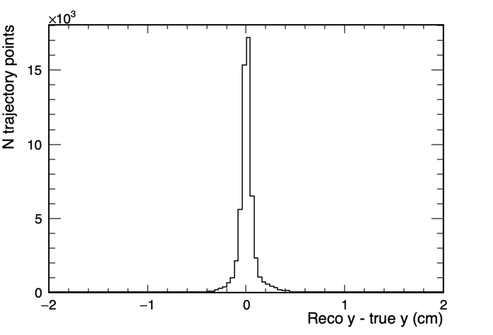
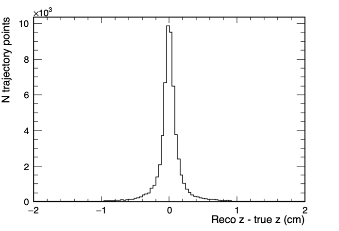

# More examples

## BackTracker1

* Module: [BackTracker1_module.cc](BackTracker1_module.cc)
* fcl file: [runbacktracker1.fcl](runbacktracker1.fcl)
* This analyzer module matches hit with each track trajectory point and then obtains the true location of energy deposition using backtracker.

  
